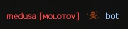
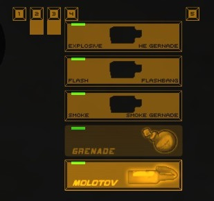

# Molotov
Custom Molotov grenade in Counter Strike 1.6 for AMX Mod X

### Требования:
- AMX Mod X 1.9.0+
- ReGameDLL 5.14.0.453 или выше
- ReAPI
- Модифицированный `delta.lst` (измененный body с 8 бит на 32 бита - `DEFINE_DELTA( body, DT_INTEGER, 32, 1.0 )`)

### Main theme —  [dev-cs.ru](https://dev-cs.ru/resources/1160/ "[GRENADE] Molotov")

___
**Автоматическое создание конфигурационного файла /addons/amxmodx/configs/plugins/plugin-grenade_molotov.cfg**
```c
// This file was auto-generated by AMX Mod X (v1.9.0.5263)
// Cvars for plugin "[GRENADE] Molotov" by "medusa" (grenade_molotov.amxx, v1.0.2)


// Флаги доступа для покупки или выдачи коктейля молотова (требует наличия вписанных; "" - покупка доступна всем).
// -
// Default: ""
molotov_buy_access ""

// Автоматически выдавать коктейль молотова в начале раунда.
// -
// Default: "0"
// Minimum: "0.000000"
// Maximum: "1.000000"
molotov_equip_access "0"

// Проверка нахождения в зоне покупки.
// -
// Default: "1"
// Minimum: "0.000000"
// Maximum: "1.000000"
molotov_check_buyzone "1"

// Цена коктейля молотова.
// -
// Default: "800"
// Minimum: "0.000000"
molotov_cost "800"

// Сколько коктейлей молотова можно купить за одн раунд (значение: -1 убирает лимит).
// -
// Default: "1"
// Minimum: "-1.000000"
molotov_buy_limit "1"

// С какого раунда после начала игры будет доступен молотов.
// -
// Default: "3"
// Minimum: "0.000000"
molotov_limit_round "3"

// Сколько урона наносить при попадании коктейля молотова в тело игрока.
// -
// Default: "2"
// Minimum: "0.000000"
molotov_check_hit_player "2"

// Показывать ли в киллфиде рядом с именем приставку [ᴍᴏʟᴏᴛᴏᴠ].
// -
// Default: "1"
// Minimum: "0.000000"
// Maximum: "1.000000"
molotov_killfeed "1"

// Радиус горения коктейля молотова.
// -
// Default: "128.0"
// Minimum: "0.000000"
molotov_radius "128.0"

// Сколько секунд коктейль молотова может находиться в полете перед взрывом.
// -
// Default: "2.0"
// Minimum: "0.000000"
molotov_throwtime "2.0"

// Сколько секунд будет гореть коктейль молотова.
// -
// Default: "12"
// Minimum: "0.000000"
molotov_duration "12"

// Кто получает урон от коктейля молотова (0 - только противники, 1 - противники и игрок бросивший коктейль молотова, 2 - все игроки).
// -
// Default: "1"
// Minimum: "0.000000"
// Maximum: "2.000000"
molotov_demage_mode "1"

// Как будет наноситься урон от огня (1 - через Ham_TakeDamage [урон фиксированный в любой точке радиуса горения], 2 - через rg_dmg_radius [урон зависит от даль
// -
// Default: "2"
// Minimum: "1.000000"
// Maximum: "2.000000"
molotov_demage_radius_mode "2"

// Переодичность нанесения урона.
// -
// Default: "0.25"
// Minimum: "0.000000"
molotov_demage_time "0.25"

// Количество нанесенного урона за период (molotov_demage_time).
// -
// Default: "20.0"
// Minimum: "0.000000"
molotov_demage_value "20.0"

// Режим отрисовки спрайтов (1 - через Entities [env_sprite], 2 - через Temporary Entities [TE_SPRITE]).
// -
// Default: "2"
// Minimum: "1.000000"
// Maximum: "2.000000"
molotov_effect_mode "2"

// Количество отрисовываемых спрайтов огня.
// -
// Default: "40"
// Minimum: "0.000000"
molotov_effect_num "40"

// Тушить ли коктейль молотова дымовой гранатой.
// -
// Default: "1"
// Minimum: "0.000000"
// Maximum: "1.000000"
molotov_smoke_touch "1"

// Путь до модели дымовой гранаты. (Стандартная: models/w_smokegrenade.mdl).
// -
// Default: "models/w_smokegrenade.mdl"
molotov_smoke_owner "models/w_smokegrenade.mdl"
```

**Благодарности:**
- `fantom`
- `Garey`
- `Denzer`
- `Shel`
- `OLOF`
- `SISA`
- `wopox1337`
- `fl0wer`
- `Xelson`
- `steelzzz`
___

`Добавлено:`

- Конфигурация.
- Автозагрузка звуков с моделей и спрайтов с txt файла.
- Убраны лишние ресурсы.
- Добавлено проигрывание звуков.
- Поддержка квара mp_buytime.
- Поддержка квара mp_nadedrops.
- Доступ по флагам.
- Автоматическая выдача.
- Покупка (проверка байзоны, установка цены, ограничение количества покупок за раунд).
- Детект попадания коктейлем молотова в игрока *и нанесение ему урона.
- Поддержка установки постфикса орудия убийства после ника в киллфиде.
  - 
- Установка радиуса, длительности горения. Переодичности и количество урона.
- Выбор того кто будет получать урон.
- Установка количества отрисовываемых спрайтов огня *влияет так же на количество создаваемых моделей огня.
- Возможность тушения дымовой гранатой.
- Поддержка броска при смерти, если коктейль молотова был зажжен.
- Плавное затухание отрисовываемых спрайтов огня.
- Горящий фитиль в полете.
- После горения на земле остаются следы *декали.
- Частичная поддержка Health Nade. *Жертвуем оружием WEAPON_TMP 
  - 
___
```c
Нужно исправить:

? Правильную работу с конфигом, чтению кваров 
? создание частиц в данный момент количество создается некорректно — (molotov_effect_mode & molotov_effect_num)
? поправить muzzflash фитиля
? в общем требуется рефакторинг кода :) :(
? еще что-то
```

```c
kekw В последних идеях было:

Разгорание по большей площади со временем
Нанесение урона в зависимости от наличия армора, а так же времени пребывания в радиусе горения.
Более лучшая визуализация эффектов чем сейчас [улучшить тайминги\плавности - появления\затухания, разброс частиц по осям, их размер, кучность, детализация, фреимрейт....]
```
___

###Заметки:

```c
человек пожаловался на то что при включённой функции molotov_smoke_touch (Тушить ли коктейль молотова дымовой гранатой) сервер через некоторое время уходит в повышенное потребление CPU вплоть до 99% при долгой игре на карте. Прямо указал что без этой функции всё нормально. Однако код модифицирован (не оригинал). В изначальном (твоём) варианте я вижу тип энтити CLASSNAME_SMOKE_TOUCHER который создаётся при условии что включён вышеупомянутый квар.

При этом в коде данный тип энтити не удаляется, ему через # времени анрегается touch (CleanUpMap или в хуке touch). Это точно нормальное поведение? Мне кажется эту энтити нужно удалять путём установки ей nextthink и SetThink(). Особо я не разбирался, мы внесли удаление как раз этим способом + в CleanUpMap вместо анрега touch() добавили удаление. Пока смотрим, вроде проблема с CPU ушла.
```

```c
public FireMolotov_Think_Post(iEntity)
{
    if (is_nullent(iEntity)) return;

    if (FClassnameIs(iEntity, EFFECT_CLASSNAME_MUZZLEFLASH)) {
        static iOwner; iOwner = get_entvar(iEntity, var_owner);
        static iItem;
        if (is_user_alive(iOwner)) {
            iItem = get_member(iOwner, m_pActiveItem);

            if (is_nullent(iItem)) {
                set_entvar(iEntity, var_flags, FL_KILLME);
            }
            else if (FClassnameIs(iItem, ITEM_CLASSNAME)) {

            }
            else {
                set_entvar(iEntity, var_flags, FL_KILLME);
            }
        }
        else {
            set_entvar(iEntity, var_flags, FL_KILLME);
        }
    }

    set_entvar(iEntity, var_nextthink, get_gametime() + 0.025);
}
```
